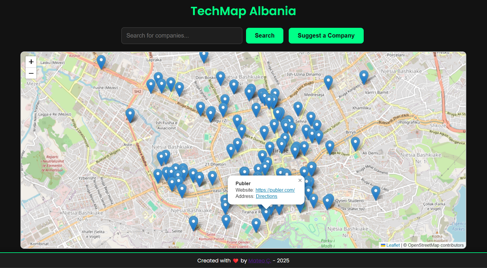

# TechMap 🗺️

TechMap is a modern, interactive web application that displays a map of Tirana city with pinned locations of tech companies. Users can search for companies, view their details, and even suggest new companies to add to the map. The app is built using **Python (Flask)** for the backend and **HTML, CSS, and JavaScript** for the frontend, with **Leaflet.js** for the interactive map.

---

## Features ✨

- **Interactive Map**: View all tech companies in your city on a map.
- **Search Functionality**: Search for specific companies by name.
- **Company Details**: Click on a company pin to see its name, website, and address.
- **Suggest a Company**: Add new companies to the map via a modern modal form.
- **Dark Theme**: Sleek, modern design with a dark theme and techy green accents.
- **Responsive Design**: Works seamlessly on both desktop and mobile devices.

---

## Screenshots 📸

  
*Example: TechMap Albania in action.*

---

## 🔗 **Check out the live demo here:** [>>> Demo Link <<<](https://techmapal.pythonanywhere.com/)

---

## Technologies Used 🛠️

- **Frontend**:
  - HTML, CSS, JavaScript
  - [Leaflet.js](https://leafletjs.com/) for the interactive map.
- **Backend**:
  - Python with [Flask](https://flask.palletsprojects.com/) for the API.
- **Data Storage**:
  - Companies are stored in a `companies.json` file.

---

## Setup Instructions 🚀

### Prerequisites
- Python 3.x
- Flask (`pip install flask`)

### Steps

- **Clone the Repository**:
   
   ```bash
     git clone https://github.com/mateo1mc/TechMap.git
     cd TechMap
   ```

- **Install Dependencies:**
   
  ```bash
    pip install requirements.txt
  ```

- **Run the Backend:**
   
  ```bash
    python app.py
  ```

- **Open the App:**
   
    - Open your browser and go to `http://127.0.0.1:5000`.

---

## How to Use 🖱️

- **View Companies:**

  - The map displays all tech companies in Tirana city. Click on a pin to see details.
  - Instantly access the official company website with a single click.
  - Get precise directions to company offices effortlessly.

- **Search for Companies:**

  - Use the search bar to filter companies by name. The map will zoom in on the first result.
  - Click the showed companies suggested in dropdown.

- **Suggest a Company:**

  - Click the "Suggest a Company" button to open the modal form.

  - Fill in the company name, website (optional), and Google Maps address (be sure to copy the URL that has lat/lng).

  - Submit the form to add the company to the map.

- **Clear Search:**

  - Click the "×" button in the search bar to clear the search and reset the map.

---

## Project Structure 📂

```
TechMap/
├── backend/
│   ├── app.py              # Flask backend
│   ├── companies.json      # Company data
│   └── requirements.txt    # Python dependencies
├── frontend/
│   ├── index.html          # Main HTML file
│   ├── styles.css          # CSS for styling
│   └── script.js           # JavaScript for interactivity
├── README.md               # Project documentation
└── TechMapAL.png           # Screenshot of the app
```

---

## Contributing 🤝

Contributions are welcome! If you'd like to improve TechMap, follow these steps:

- Fork the repository.

- Create a new branch (`git checkout -b feature/YourFeature`).

- Commit your changes (`git commit -m 'Add some feature'`).

- Push to the branch (`git push origin feature/YourFeature`).

- Open a pull request.

---

## License 📜

This project is licensed under the MIT License. See the [LICENSE](https://github.com/mateo1mc/TechMap/blob/fdb2cfc8e58a4ebf870547f8d2ace240fa825e45/LICENSE) file for details.

---

## Acknowledgments 🙏

[Leaflet.js](https://leafletjs.com/) for the interactive map library.

[Flask](https://flask.palletsprojects.com/en/stable/) for the lightweight backend framework.

[Google Fonts](https://fonts.google.com/) for the Poppins font.

---

## Contact 📧

If you have any questions or suggestions, feel free to reach out:

<p align="center">
  <a href="https://www.linkedin.com/in/mateo1mc/" target="blank"></a>
  <a href="https://github.com/mateo1mc/" target="blank"></a>
</p> 

---

<h2 align = "center">Support Me</h2>
<p align="center">
<!--   <a href="https://www.buymeacoffee.com/mateo1mc" target="_blank"> -->
    <a href="https://www.paypal.com/paypalme/mateo1mc" target="_blank">
  </a>
</p>

---
